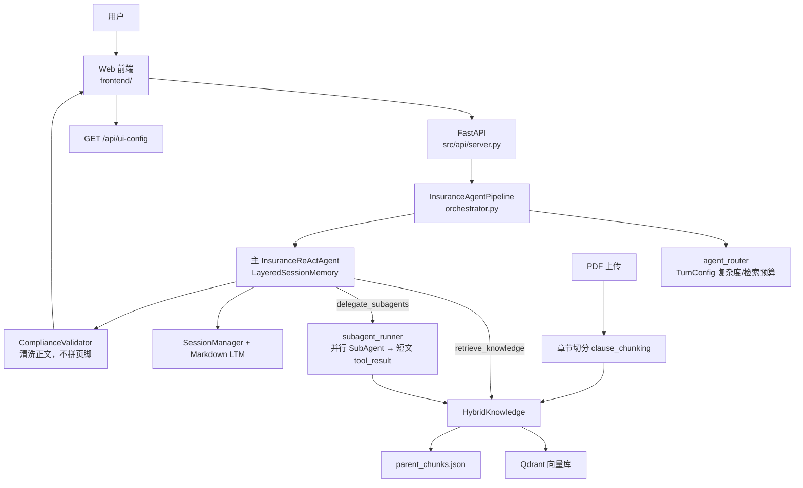

# Loop Insurance Agent

基于 [AgentScope](https://github.com/agentscope-ai/agentscope) 的保险条款智能咨询系统：Web 上传 PDF 入库 → 混合 RAG 检索 → **主 ReAct Agent**（可选工具 `delegate_subagents` 并行子任务）→ 合规清洗 → SSE 流式对话；免责声明与来源提示由**前端**统一展示。

| 文档 | 说明 |
|------|------|
| [docs/architecture.md](docs/architecture.md) | 完整架构图、时序图、模块映射 |
| [docs/README.md](docs/README.md) | 文档目录与阅读顺序 |
| [项目理解.txt](项目理解.txt) | 中文模块速览（便于 onboarding） |
| [.env.example](.env.example) | 环境变量模板 |

## 系统架构概览



## 核心能力

| 能力 | 实现 | 说明 |
|------|------|------|
| 轮次配置 | `agent_router.py` | 复杂度与检索预算；**不**做 Main/Sub 路径分叉 |
| 主 Agent | `insurance_agent.py` + `insurance_react_agent.py` | ReAct；`retrieve_knowledge` + `delegate_subagents` |
| SubAgent | `subagent_tool.py` + `subagent_runner.py` | 主 Agent 工具触发；并行检索后返回带引用的短文 |
| 会话记忆 | `layered_session_memory.py` | 每 `session_id` 两层上下文（软视图 / 硬压缩） |
| 长期记忆 | `markdown_long_term_memory.py` + `ltm_merge.py` | Markdown 文件；Agent 工具读写 + 回合后 LLM 合并 |
| RAG | `hybrid_knowledge.py` | 向量 + BM25 + RRF + Rerank；parent/child 章节 |
| 工具限长 | `tool_response_limits.py` | 单次检索块数与总字符上限 |
| 合规 | `validator.py` | Hook 清洗正文；免责/来源提示由前端 + `compliance` 元数据 |
| 模型 | `chat_model_factory.py` / `embedding_factory.py` | DeepSeek 或 DashScope 对话；嵌入可独立配置 |

## 环境要求

- **Python** 3.10 及以上（建议 3.11+）
- 可访问 **DeepSeek** 和/或 **DashScope** API（对话与嵌入可分离配置）
- 磁盘空间用于 `data/vector_store`（Qdrant 本地持久化）与 `data/memory_store`（Markdown 长期记忆）

## 快速开始

### 1. 安装依赖

```bash
python -m venv .venv
# Windows: .venv\Scripts\activate
# Linux/macOS: source .venv/bin/activate
pip install -r requirements.txt
```

### 2. 配置环境变量

```bash
cp .env.example .env
```

**默认使用 DeepSeek 对话**，向量嵌入仍用 DashScope：

```env
LLM_PROVIDER=deepseek
DEEPSEEK_API_KEY=你的_DeepSeek_Key
MODEL_NAME=deepseek-chat
DASHSCOPE_API_KEY=你的_DashScope_Key
EMBEDDING_PROVIDER=dashscope
EMBEDDING_MODEL=text-embedding-v4
EMBEDDING_DIMENSIONS=1024
```

更多项见 [配置说明](#配置说明) 与 [如何更换模型](#如何更换模型)。

### 3. 启动 Web 界面（推荐）

```bash
python -m src.web_main
```

浏览器打开 `http://127.0.0.1:8001`（`API_HOST` / `API_PORT` 可改）。页面上传 PDF 后写入持久化向量库，**不保存 PDF 源文件**。

前端能力概览：多 Tab 会话（`localStorage`）、拖拽/选择上传、SSE 流式回答（`delta` 增量 + 节流渲染）、推理过程展示、后端重启检测（`server_boot_id`）、全局免责与条件来源提示。

### 4. CLI 对话

```bash
python -m src.main
```

### 5. （可选）批量导入 PDF

```bash
python scripts/ingest_documents.py /path/to/pdfs
```

## API 接口

| 方法 | 路径 | 说明 |
|------|------|------|
| GET | `/` | 前端静态页 |
| GET | `/static/*` | 前端静态资源（JS/CSS/vendor） |
| GET | `/api/health` | 健康检查；返回 `policies_count`、`server_boot_id` |
| GET | `/api/ui-config` | 免责声明、来源提示文案（前端展示） |
| GET | `/api/documents` | 已入库保单列表 |
| POST | `/api/upload` | PDF 上传入库（仅 `.pdf`，受 `MAX_UPLOAD_SIZE_MB` 限制） |
| DELETE | `/api/documents/{filename}` | 删除指定保单 |
| DELETE | `/api/documents` | 清空保单库；请求体可选 `clear_long_term` |
| POST | `/api/chat/stream` | **SSE** 流式对话；`done` 含 `compliance` |
| POST | `/api/chat` | 非流式；返回 `reply` + `compliance` |
| DELETE | `/api/sessions/{session_id}` | 清空会话短期记忆（进程内，重启丢失） |

**聊天请求体**（`ChatRequest`）：`message`（1–4000 字）、`session_id`（默认 `default`）。

**SSE 事件**（`type`）：`thinking`、`answer`（含 `delta`、`stream_id`、`last`）、`done`、`error`。

## 项目结构

```
Loop_Insurance_Agent/
├── src/
│   ├── config.py
│   ├── main.py                   # CLI
│   ├── web_main.py               # Web 入口
│   ├── api/server.py             # FastAPI + SSE + 静态资源
│   ├── pipeline/
│   │   ├── orchestrator.py       # Pipeline 编排
│   │   ├── agent_router.py       # TurnConfig（复杂度/检索预算）
│   │   ├── question_decomposer.py
│   │   ├── subagent_runner.py    # SubAgent 并行 + 短文汇总
│   │   └── streaming.py          # Msg → SSE（delta）
│   ├── agent/
│   │   ├── insurance_agent.py    # Agent 工厂与 system prompt
│   │   ├── insurance_react_agent.py
│   │   └── subagent_tool.py      # delegate_subagents 工具
│   ├── model/
│   │   ├── chat_model_factory.py
│   │   ├── embedding_factory.py
│   │   ├── dashscope_factory.py
│   │   ├── context_window_registry.py
│   │   └── thinking_aware_formatter.py
│   ├── memory/
│   │   ├── layered_session_memory.py
│   │   ├── context_window_manager.py
│   │   ├── context_attachments.py
│   │   ├── session_manager.py
│   │   ├── manager.py
│   │   ├── markdown_long_term_memory.py
│   │   └── ltm_merge.py
│   ├── rag/                      # 混合检索、切分、限长等
│   └── compliance/validator.py
├── frontend/                     # index.html + app.js + styles.css
├── docs/
│   ├── README.md
│   └── architecture.md
├── scripts/
│   ├── ingest_documents.py       # 批量 PDF 入库
│   ├── run_eval_test.py          # 40 题评测
│   ├── run_eval_memory_ablation.py  # 记忆消融实验
│   ├── postprocess_eval.py / score_eval.py
│   └── run_eval_direct_llm.py    # 无 RAG 基线
├── .env.example
├── requirements.txt
└── data/
    ├── vector_store/             # Qdrant + manifest + parent
    └── memory_store/             # Markdown 长期记忆（{user_id}.md）
```

## 配置说明

| 环境变量 | 默认值 | 说明 |
|----------|--------|------|
| `LLM_PROVIDER` | `deepseek` | 对话：`deepseek` 或 `dashscope` |
| `DEEPSEEK_API_KEY` | — | `LLM_PROVIDER=deepseek` 时必填 |
| `DEEPSEEK_BASE_URL` | `https://api.deepseek.com` | DeepSeek API 基址 |
| `DASHSCOPE_API_KEY` | — | 嵌入默认必填；通义对话时必填 |
| `DASHSCOPE_BASE_URL` | — | 可选，国际站等 |
| `MODEL_NAME` | `deepseek-chat` | 主 Agent / SubAgent |
| `DECOMPOSE_MODEL_NAME` | `deepseek-chat` | **复杂度评估**（非路径路由） |
| `COMPRESSION_MODEL_NAME` | `deepseek-chat` | 两层上下文摘要 |
| `MAX_MAIN_AGENT_RETRIEVALS` | `5` | 中复杂度主 Agent 检索上限 |
| `MAX_MAIN_AGENT_RETRIEVALS_LOW` | `3` | 低复杂度 |
| `MAX_MAIN_AGENT_RETRIEVALS_HIGH` | `6` | 高复杂度 |
| `SUBAGENT_ENABLED` | `true` | 是否注册 `delegate_subagents` 工具 |
| `SUBAGENT_MIN_QUESTIONS` | `2` | 建议触发委托的最少子问题数（prompt 约束） |
| `MAX_SUBAGENTS` | `5` | 单轮最多子 Agent |
| `MAX_SUBAGENT_CONCURRENCY` | `3` | 并行度 |
| `MAX_SUBAGENT_RETRIEVALS` | `4` | SubAgent 单次检索上限（中复杂度） |
| `MAX_SUBAGENT_RETRIEVALS_HIGH` | `5` | SubAgent 高复杂度检索上限 |
| `SUBAGENT_TOOL_MAX_CHARS` | `3500` | 工具返回短文上限 |
| `RAG_TOOL_LIMIT` | `3` | 单次工具最大块数 |
| `RAG_MAX_CHUNK_DISPLAY_CHARS` | `2000` | 单块展示字符上限 |
| `RAG_MAX_TOOL_RESPONSE_CHARS` | `8000` | 工具响应总字符上限 |
| `MODEL_CONTEXT_WINDOW` | `0` | 0 = 按 `MODEL_NAME` 查表 |
| `CONTEXT_SOFT_RATIO` | `0.8` | 软层动态视图阈值 |
| `CONTEXT_HARD_RATIO` | `0.93` | 硬压缩比例阈值 |
| `CONTEXT_HARD_RESERVE_TOKENS` | `13000` | 硬阈值与 93% 取较大值 |
| `AGENT_COMPRESSION_KEEP_RECENT` | `4` | 软层保留最近消息条数（`.env.example` 推荐 `5`） |
| `LONG_TERM_AUTO_PROFILE` | `true` | 关键词命中时 LLM 合并写入 Markdown 长期记忆 |
| `PROFILE_MODEL_NAME` | 同 `DECOMPOSE_MODEL_NAME` | 长期记忆合并所用模型 |
| `USER_ID` | `default_user` | 长期记忆 Markdown 文件名前缀 |
| `VECTOR_STORE_PATH` | `./data/vector_store` | Qdrant 本地目录 |
| `VECTOR_STORE_PERSIST` | `true` | 是否持久化向量库 |
| `LONG_TERM_MEMORY_PATH` | `./data/memory_store` | 长期记忆 Markdown 目录 |
| `DISCLAIMER_TEXT` | 见 `config.py` | 前端全局免责（不写进 Agent 正文） |
| `SOURCE_NOTICE_TEXT` | 见 `config.py` | 涉及条款时消息下来源提示 |
| `EMBEDDING_PROVIDER` | `dashscope` | `dashscope` 或 `openai`（兼容 API） |
| `EMBEDDING_MODEL` | `text-embedding-v4` | 嵌入模型 |
| `EMBEDDING_DIMENSIONS` | `1024` | 改维度需重建向量库 |
| `MAX_UPLOAD_SIZE_MB` | `20` | PDF 上传大小上限 |
| `API_HOST` | `127.0.0.1` | Web 监听地址 |
| `API_PORT` | `8001` | Web 端口 |

修改 `.env` 后需**重启进程**。

## 如何更换模型

改 **`.env`** 后重启 Web/CLI。

### 1. DeepSeek（默认）

```env
LLM_PROVIDER=deepseek
DEEPSEEK_API_KEY=sk-...
MODEL_NAME=deepseek-chat
COMPRESSION_MODEL_NAME=deepseek-chat
DECOMPOSE_MODEL_NAME=deepseek-chat
DASHSCOPE_API_KEY=sk-...          # 嵌入用，不能删
EMBEDDING_MODEL=text-embedding-v4
```

常用 ID：`deepseek-chat`、`deepseek-reasoner`。

### 2. 通义千问

```env
LLM_PROVIDER=dashscope
DASHSCOPE_API_KEY=sk-...
MODEL_NAME=qwen-plus
COMPRESSION_MODEL_NAME=qwen-turbo
DECOMPOSE_MODEL_NAME=qwen-turbo
```

多模态型号由 `dashscope_factory.py` 处理 API 别名。

### 3. 分工

| 能力 | 配置项 |
|------|--------|
| 主/子 Agent 对话 | `MODEL_NAME` |
| 复杂度评估 | `DECOMPOSE_MODEL_NAME` |
| 上下文摘要 | `COMPRESSION_MODEL_NAME` |
| 向量检索 | `EMBEDDING_*` |

入口：`chat_model_factory.py`、`embedding_factory.py`。

### 4. 更换 Embedding

修改 `EMBEDDING_MODEL` 或 `EMBEDDING_DIMENSIONS` 后，需重新上传 PDF 或清空 `data/vector_store` 再建索引。

## 示例对话

```
您: 这份重疾险的等待期是多久？

助手: 根据《康健人生重大疾病保险条款》第四条「等待期」的规定：
自本合同生效（或最后复效）之日起 **90 日** 为等待期…

（页面底部：免责声明；涉及条款的消息下：来源提示）
```

## 技术栈

- **Agent**：AgentScope ReActAgent、Toolkit、长期记忆工具  
- **对话**：DeepSeek（默认）或通义 DashScope  
- **嵌入**：DashScope `text-embedding-v4`（可 OpenAI 兼容）  
- **向量库**：Qdrant（本地 path）  
- **长期记忆**：Markdown 文件（`agent_control` 工具读写 + 回合后 LLM 合并）  
- **检索**：Dense + BM25 + RRF + Rerank；章节 parent 返回  
- **Web**：FastAPI + Uvicorn + SSE（thinking/answer 增量 `delta` + 前端节流渲染）  

## 扩展指南

- **更换模型**：见上文；改 `.env` 后重启  
- **禁用 SubAgent 工具**：`SUBAGENT_ENABLED=false`（复杂多问需主 Agent 多次检索）  
- **添加文档**：Web 上传或 `scripts/ingest_documents.py`  
- **合规文案**：`DISCLAIMER_TEXT`、`SOURCE_NOTICE_TEXT`；`GET /api/ui-config`  
- **合规逻辑**：`src/compliance/validator.py`  
- **轮次与检索**：`src/pipeline/agent_router.py`、`src/config.py`  
- **架构细节**：`docs/architecture.md`  

## 两层上下文窗口

主 Agent 使用 `LayeredSessionMemory`：

1. **读取窗口**：`MODEL_NAME` 或 `MODEL_CONTEXT_WINDOW` 决定 token 上限。  
2. **软层（≥80%）**：本地 `content` 完整保留；API 调用前生成动态视图（早期摘要 + 工具块 + 中间摘要 + 最近 N 条原文）。  
3. **硬层（≥ max(93%×窗口, 窗口−13k)）**：整段摘要后工作区替换为：边界标记、全量摘要、附件（保单列表等）、最近一轮；完整快照存入 `archives`。

`delegate_subagents` 的 tool_result 留在 session 内，便于追问引用。

## 已知限制

- **会话记忆在进程内**：`DELETE /api/sessions/{id}` 或前端「清空对话」只清当前进程；**重启后端**会丢失全部 session（前端通过 `server_boot_id` 提示）。  
- **清空对话** 不清 Markdown 长期记忆；需「清空库」并设 `clear_long_term=true`，或删 `data/memory_store` 下对应 `{user_id}.md`。  
- **硬压缩后** 较早 tool 细节主要留在 archives / 本地 content，API 视图以摘要为主。  
- **HTTP 请求体** 仍有厂商体积上限（约 6MB），与 token 窗口无关。  
