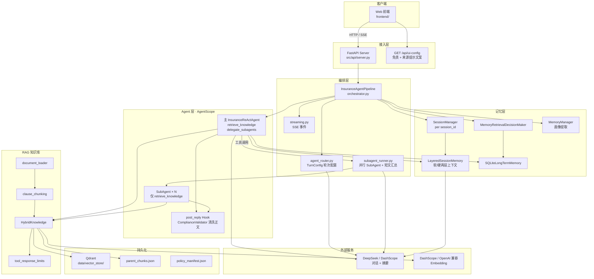
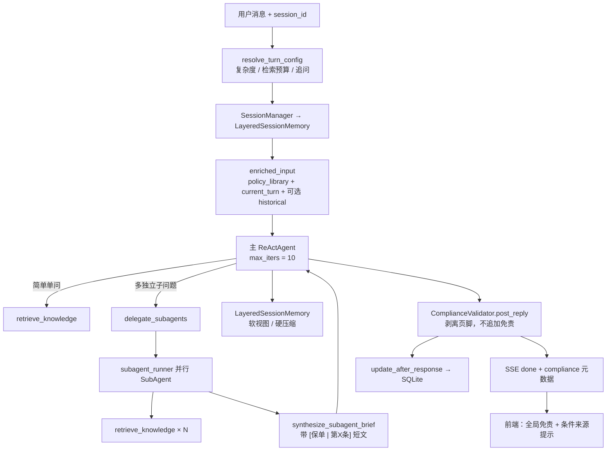
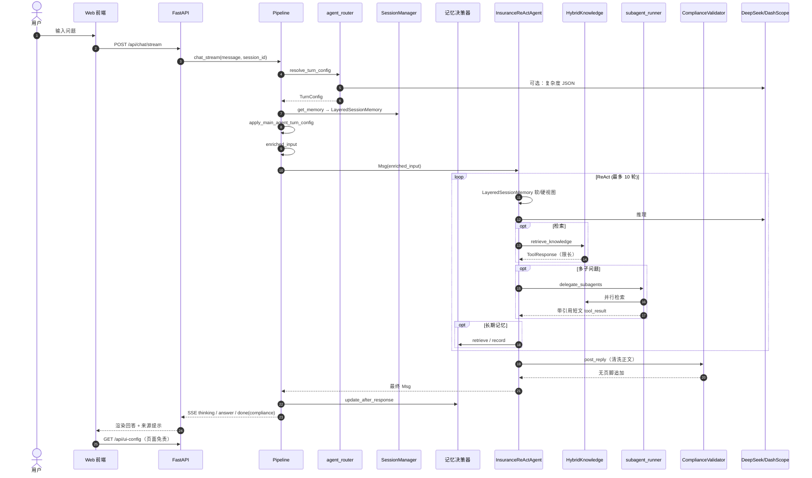
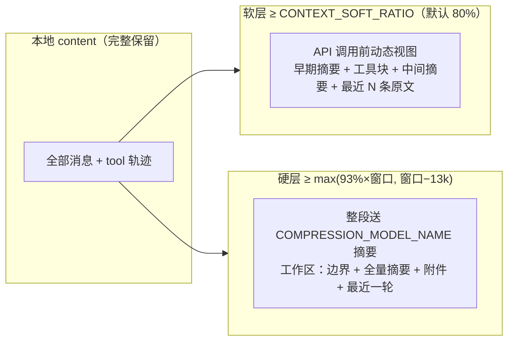
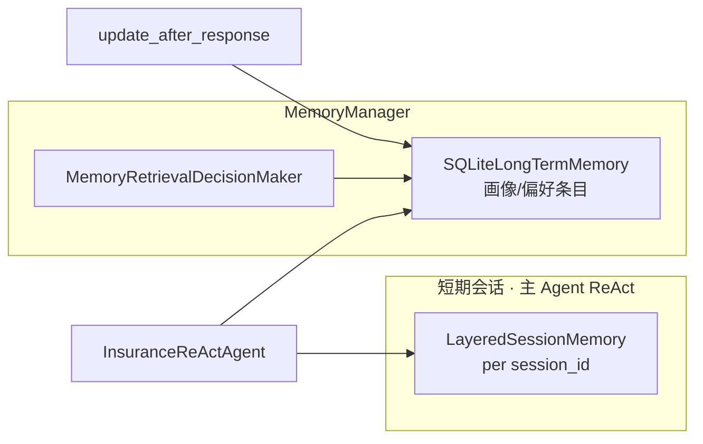
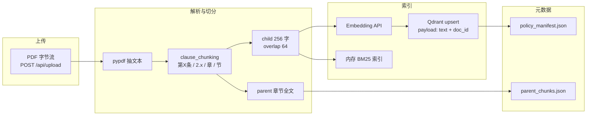
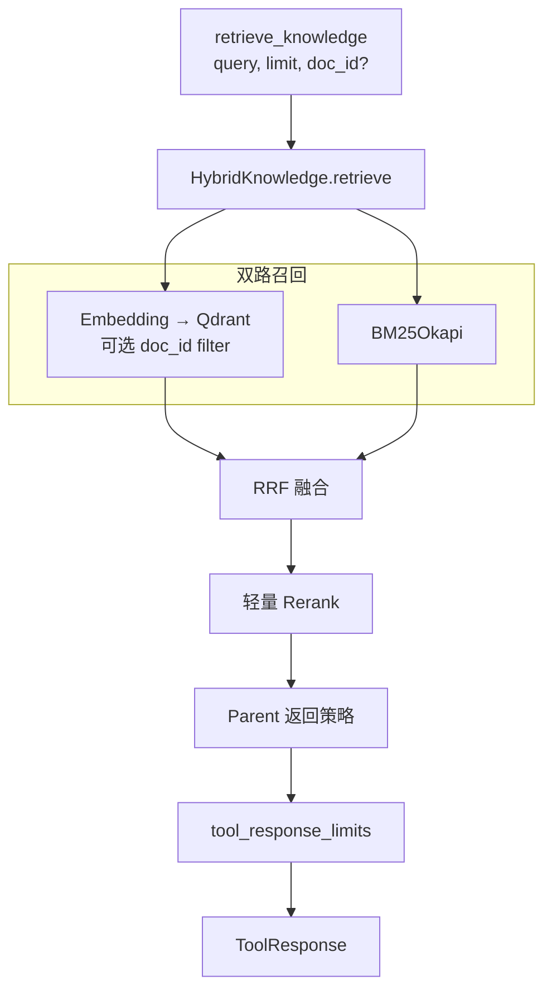
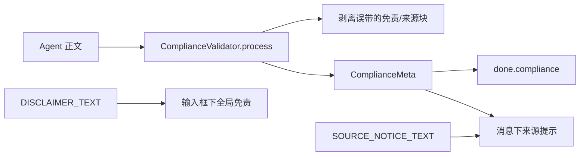

# Loop Insurance Agent 系统架构

本文档描述当前代码库的整体架构、对话编排、记忆与 RAG 设计，便于绘制架构图与时序图。

文档索引与阅读顺序见 [docs/README.md](README.md)；快速上手见根目录 [README.md](../README.md)。

---

## 1. 系统定位

**保险条款智能咨询系统**：用户上传保单 PDF → 条款入库向量库 → 多轮对话通过 RAG 检索 + 主 ReAct Agent 作答 → 合规清洗与前端展示。

- **不保存 PDF 源文件**，仅持久化 Qdrant 向量、章节 parent 映射、保单 manifest、SQLite 长期记忆。
- **框架**：AgentScope `ReActAgent`（`InsuranceReActAgent` 扩展）。
- **对话模型**：默认 DeepSeek（OpenAI 兼容 API）；可切换通义 DashScope。
- **向量嵌入**：默认 DashScope `text-embedding-v4`（与对话提供商可分离）。
- **入口**：Web（FastAPI + SSE）为主；CLI（`src/main.py`）为辅。

---

## 2. 总体分层架构



---

## 3. 对话编排（单主 Agent + 工具委托）

**不再有 Pipeline 级的「主路径 / SubAgent 路径」二选一**。每条用户消息统一进入主 `InsuranceReActAgent`；多子问题由主 Agent **自行决定**是否调用工具 `delegate_subagents`。



### 3.1 轮次配置 `TurnConfig`

由 `resolve_turn_config()`（`src/pipeline/agent_router.py`）生成，**不决定走哪条 Agent 路径**：

| 字段 | 含义 |
|------|------|
| `complexity` | `low` \| `medium` \| `high`（启发式 + 可选 `DECOMPOSE_MODEL_NAME` JSON） |
| `max_retrievals` | 主 Agent 本轮 `retrieve_knowledge` 上限 |
| `is_follow_up` | 短句追问 → 减少历史注入 |
| `inject_historical_memory` | 是否注入 SQLite 用户画像 `<user_profile>`（非对话全文） |
| `reason` | 配置理由（日志） |

**追问处理**（`detect_follow_up`）：短句且未显式引用历史时，`is_follow_up=true` → 不注入 `<user_profile>`。

### 3.2 SubAgent 委托工具

| 项 | 说明 |
|------|------|
| 工具名 | `delegate_subagents`（`src/agent/subagent_tool.py`） |
| 触发 | 主 Agent 按 system prompt 判断；`SUBAGENT_ENABLED=false` 时工具返回禁用提示 |
| 子问题数 | 至少 `SUBAGENT_MIN_QUESTIONS`（默认 2），最多 `MAX_SUBAGENTS` |
| 并行度 | `MAX_SUBAGENT_CONCURRENCY` |
| 返回 | `synthesize_subagent_brief` 生成的短文（≤ `SUBAGENT_TOOL_MAX_CHARS`），含条款引用 |
| 会话 | tool_result **写入** `LayeredSessionMemory`，追问时可引用 |

SubAgent 本身：临时 `InMemoryMemory`、仅 `retrieve_knowledge`、合规 Hook 清洗、**无**长期记忆工具。

### 3.3 模型分工

| 用途 | 配置项 | 默认（DeepSeek 模式） |
|------|--------|----------------------|
| 主对话 / SubAgent | `MODEL_NAME` | `deepseek-chat` |
| 复杂度评估（可选 LLM） | `DECOMPOSE_MODEL_NAME` | `deepseek-chat` |
| 两层上下文摘要 | `COMPRESSION_MODEL_NAME` | `deepseek-chat` |
| 长期记忆注入决策 | `MemoryRetrievalDecisionMaker` | 与 MemoryManager 同模型 |
| 向量 | `EMBEDDING_*` | DashScope `text-embedding-v4` |

对话模型：`src/model/chat_model_factory.py`；嵌入：`src/model/embedding_factory.py`；通义多模态别名：`dashscope_factory.py`。

---

## 4. 主 Agent 路径时序（SSE）



### 4.1 主 Agent 输入块（`enriched_input`）

1. `<policy_library>` — 已入库保单 filename 列表  
2. `<current_turn_only>` — 只答本轮；可引用历史中 `delegate_subagents` 工具结果  
3. `<user_profile>` — 可选，用户画像/偏好（SQLite，跳过旧版「用户问/助手答」记录）  
4. `<retrieval_budget>` — 本轮最多 `retrieve_knowledge` 次数  
5. `【本轮用户问题】` — 用户原文  

---

## 5. 两层上下文窗口（`LayeredSessionMemory`）

主 Agent 会话记忆不再使用「超阈值字符压缩」单一路径，改为 **软层动态视图 + 硬层整段摘要**：



| 配置项 | 默认 | 说明 |
|--------|------|------|
| `MODEL_CONTEXT_WINDOW` | `0`（按模型名查表） | token 上限 |
| `CONTEXT_SOFT_RATIO` | `0.8` | 触发软层视图 |
| `CONTEXT_HARD_RATIO` | `0.93` | 硬压缩比例阈值 |
| `CONTEXT_HARD_RESERVE_TOKENS` | `13000` | 与 93% 取较大值作为硬阈值 |
| `AGENT_COMPRESSION_KEEP_RECENT` | `4` | 软层保留最近消息条数（`.env.example` 常设为 `5`） |
| `COMPRESSION_MODEL_NAME` | 同对话模型 | 摘要模型 |

实现：`src/memory/layered_session_memory.py`、`src/memory/context_window_manager.py`。

---

## 6. 记忆架构



| 类型 | 存储 | 生命周期 | 读写方 |
|------|------|----------|--------|
| **Session 短期** | `LayeredSessionMemory` | 同 session 多轮；`DELETE /api/sessions/{id}` 清空 | 主 Agent；含 tool / delegate 结果 |
| **长期** | `data/memory_store/{user_id}.db` | 跨 session | 画像/偏好摘要；`record()` 不写入对话全文 |

主 Agent `long_term_memory_mode="agent_control"`：仅通过工具或编排注入画像；回合结束不再 dump 会话。

---

## 7. PDF 入库流（无源文件落盘）



**启动时**：不扫描本地 PDF 目录；`restore_bm25_from_vector_store()` 从 Qdrant 恢复 BM25，并加载 manifest / parent。

---

## 8. RAG 混合检索



环境变量：`RAG_TOOL_LIMIT`、`RAG_MAX_CHUNK_DISPLAY_CHARS`、`RAG_MAX_TOOL_RESPONSE_CHARS`。

---

## 9. API 与 SSE

| 方法 | 路径 | 说明 |
|------|------|------|
| GET | `/` | 前端 |
| GET | `/api/health` | 健康 + 保单数 + `server_boot_id`（前端检测后端重启） |
| GET | `/static/*` | 前端静态资源 |
| GET | `/api/ui-config` | 免责声明、来源提示文案（前端展示） |
| GET | `/api/documents` | 保单列表 |
| POST | `/api/upload` | PDF 入库（`MAX_UPLOAD_SIZE_MB`，仅 `.pdf`） |
| DELETE | `/api/documents/{filename}` | 删保单 |
| DELETE | `/api/documents` | 清空库 |
| POST | `/api/chat/stream` | SSE 流式对话 |
| POST | `/api/chat` | 非流式（含 `compliance` 字段） |
| DELETE | `/api/sessions/{session_id}` | 清会话记忆 |

**聊天请求**：`message`（1–4000 字）、`session_id`（默认 `default`）。

**SSE 事件类型**（`streaming.py` / `orchestrator.chat_stream`）：

| type | 说明 |
|------|------|
| `thinking` | 推理过程；含 `delta`、`content`、`stream_id`、`last` |
| `answer` | 回答 token（流式增量 `delta`） |
| `done` | 最终 `answer`、`thinking`、`compliance` |
| `error` | 错误信息 |

流式事件通过 `_compute_delta` 仅推送相对上一帧的增量；前端约 64ms 节流刷新 DOM，避免每包全量 `innerHTML`。

**健康检查 `server_boot_id`**：进程启动时生成的 UUID；前端比对 `localStorage`，变化时提示「后端已重启、会话记忆已丢失」。

**`done.compliance` 字段**：

| 字段 | 说明 |
|------|------|
| `applies` | 回答是否涉及条款类关键词 |
| `show_source_notice` | 前端是否在消息下展示来源提示 |
| `has_source_citation` | 正文是否已含来源类表述 |

---

## 10. 合规展示



- **Agent 约束**：system prompt 要求条款引用格式；禁止在末尾写免责声明或来源提示段落。  
- **Hook**：`post_reply` 仅清洗，不向正文追加 UI 文案。  
- **前端**：`GET /api/ui-config` + SSE `compliance` 驱动展示。

---

## 11. 模块与代码映射

| 层级 | 模块 | 路径 |
|------|------|------|
| 入口 | Web | `src/web_main.py` |
| 入口 | CLI | `src/main.py` |
| API | REST + SSE | `src/api/server.py` |
| 编排 | Pipeline | `src/pipeline/orchestrator.py` |
| 编排 | 轮次配置 | `src/pipeline/agent_router.py` |
| 编排 | SubAgent 执行 | `src/pipeline/subagent_runner.py` |
| 编排 | SSE 转换 | `src/pipeline/streaming.py` |
| Agent | 工厂 + prompt | `src/agent/insurance_agent.py` |
| Agent | 上下文感知 ReAct | `src/agent/insurance_react_agent.py` |
| Agent | SubAgent 工具 | `src/agent/subagent_tool.py` |
| 模型 | 对话工厂 | `src/model/chat_model_factory.py` |
| 模型 | 嵌入工厂 | `src/model/embedding_factory.py` |
| 模型 | 通义专用 | `src/model/dashscope_factory.py` |
| 记忆 | 两层会话 / 管理 / SQLite | `src/memory/` |
| 记忆 | 画像提取 | `src/memory/profile_memory.py` |
| 记忆 | 长期记忆注入决策 | `src/memory/retrieval_decision.py` |
| 记忆 | 硬压缩附件（保单列表等） | `src/memory/context_attachments.py` |
| 编排 | 问题分解（复杂度辅助） | `src/pipeline/question_decomposer.py` |
| 模型 | 上下文窗口查表 | `src/model/context_window_registry.py` |
| 模型 | 推理块格式化 | `src/model/thinking_aware_formatter.py` |
| 前端 | UI | `frontend/`（多 Tab、`localStorage`、重启横幅） |
| RAG | 混合检索 / 切分 / 限长 | `src/rag/` |
| 合规 | 清洗 + UI 元数据 | `src/compliance/validator.py` |
| 配置 | Settings | `src/config.py` |

---

## 12. 持久化目录

```
data/
├── vector_store/          # Qdrant 本地持久化
│   ├── collection/
│   ├── policy_manifest.json
│   └── parent_chunks.json
└── memory_store/          # SQLite 长期记忆
    └── {user_id}.db
```

PDF 源文件 **不** 写入磁盘。

---

## 13. 配置旋钮（运维参考）

| 类别 | 环境变量 |
|------|----------|
| 对话提供商 | `LLM_PROVIDER`, `DEEPSEEK_*`, `DASHSCOPE_*` |
| 主模型 | `MODEL_NAME` |
| 复杂度评估 | `DECOMPOSE_MODEL_NAME` |
| 上下文摘要 | `COMPRESSION_MODEL_NAME`, `CONTEXT_*`, `AGENT_COMPRESSION_KEEP_RECENT` |
| SubAgent 工具 | `SUBAGENT_ENABLED`, `SUBAGENT_MIN_QUESTIONS`, `MAX_SUBAGENTS`, `MAX_SUBAGENT_CONCURRENCY`, `MAX_SUBAGENT_RETRIEVALS`, `MAX_SUBAGENT_RETRIEVALS_HIGH`, `SUBAGENT_TOOL_MAX_CHARS` |
| 上传 / 服务 | `MAX_UPLOAD_SIZE_MB`, `API_HOST`, `API_PORT`, `VECTOR_STORE_PERSIST` |
| 主 Agent 检索分档 | `MAX_MAIN_AGENT_RETRIEVALS`, `_LOW`, `_HIGH` |
| RAG 体积 | `RAG_TOOL_LIMIT`, `RAG_MAX_*` |
| 合规文案（仅前端） | `DISCLAIMER_TEXT`, `SOURCE_NOTICE_TEXT` |
| 嵌入 | `EMBEDDING_*` |
| 存储 | `VECTOR_STORE_PATH`, `LONG_TERM_MEMORY_PATH`, `USER_ID` |

---

## 14. 已知限制

1. **会话仅存进程内**：重启后端丢失全部 `session_id` 短期记忆；前端通过 `server_boot_id` 提示用户。  
2. **清空对话不清画像**：`DELETE /api/sessions/{id}` 只清 session；旧版 SQLite 中「用户问/助手答」条目检索时会被跳过。  
3. **硬压缩后**：工作区为摘要 + 最近一轮，更早 tool 细节仅在 `archives` 与本地 `content` 中保留。  
4. **HTTP 体积极限**：厂商请求体上限（约 6MB）与 token 上下文窗口无关。  
5. **SubAgent 禁用**：`SUBAGENT_ENABLED=false` 时工具不可用，复杂多问需主 Agent 多次 `retrieve_knowledge`。

---

## 15. 建议绘图清单

| 图号 | 类型 | 内容 |
|------|------|------|
| 1 | C4 上下文 | 用户、Web、Agent、LLM/Embedding、Qdrant、SQLite |
| 2 | 容器/分层 | §2 总体分层 |
| 3 | 时序 | §4 主 Agent SSE（含可选 delegate） |
| 4 | 流程图 | §3 单主 Agent + 工具委托 |
| 5 | 流程图 | §5 两层上下文 |
| 6 | 数据流 | §7 入库 + §8 RAG |
| 7 | 组件图 | §6 记忆 + §10 合规 |

---

## 16. 技术栈

- **Agent 框架**：AgentScope ReActAgent、Toolkit、长期记忆工具  
- **对话 LLM**：DeepSeek（默认）或通义 DashScope  
- **向量嵌入**：DashScope `text-embedding-v4`（可 OpenAI 兼容 API）  
- **向量库**：Qdrant（本地 path）  
- **长期记忆**：SQLite  
- **检索**：Dense + BM25 + RRF + Rerank + parent 返回  
- **Web**：FastAPI + Uvicorn + SSE；原生 HTML/JS 前端  
